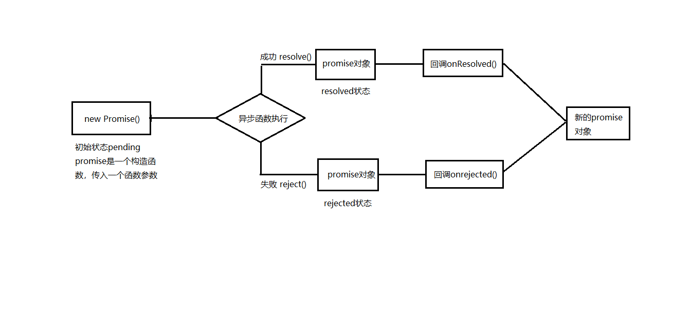

# 同步回调与异步回调
常见的同步回调有数组遍历的回调、promise中的excutor函数
常见的异步回调有promise的成功失败回调、ajax回调、定时器回调
# 常见的内置错误
Reference Error -- 引用错误
Type Error -- 类型错误
Range Error -- 范围错误（通常发生在递归函数中）
Syntax Error -- 语法错误
# 错误处理
方法一、try...catch方法
方法二、throw error方法
# promise的基础
promise是es6提出新的解决异步的方法
从语法上讲promise是一个构造函数
从功能上讲promise是用来封装一个异步函数并可以获取到其结果
# 思维导图


# promise的基本使用
```js
setTimeout(()=>{
            console.log('一个简单的异步');
            
        },1000)
       const promise = new Promise((resolve,reject)=>{
        //    执行器函数是一个同步的回调函数
        console.log('excutor是同步的回调函数');
           setTimeout(()=>{
            let time = Date.now();
            if(time %2 === 0){
                resolve('成功，time='+time);
            }else{
                reject('失败，time='+time);
            }
           },1000)
       })
       console.log('执行器之后');
        //发现问题只有当执行器函数中是一个同步操作时，
        // then方法才会被优先执行   
        // 为什么呢？ 

       promise.then((value)=>{
        console.log(value);
        
       },(error)=>{
        console.log(error);
        
       })
```
# promise封装异步函数的好处
+ 指定回调函数的方式更加灵活
普通的异步函数，我们指定回调函数通常是先于异步函数本身的执行的；
而使用了promise之后，我们的回调函数可以在then中编写，而封装的异步函数的执行是先于回调函数的声明的，甚至我们可以等待异步操作的执行完毕之后，在进行回调函数;
+ 解决回调地狱的问题
什么是回调地狱：当我们多层异步任务嵌套在一起，里面的任务的执行依托于外部任务的执行状态的时候，回调地狱就产生了；
回调地狱：可读性差、维护性差
# promise你必须知道的API
1. Promise()构造函数:Promise(excutor){}
excutor函数:同步执行(resolve,reject)=>{}
resolve函数:内部定义成功时的回调函数 value=>{}
reject函数:内部定义失败时的回调函数 reason=>{}
说明：excutor函数本身是一个同步执行的回调函数，包含在该函数内部的异步函数会异步执行

2. Promise.prototype.then()
内部的两个函数参数 (onResolved,onRejected)=>{}
onResolved: 成功的回调函数(value)=>{}
onRejected: 失败的回调函数(reason)=>{}
两个函数会返回一个新的promise对象
返回对象promise实现链式编程的关键点

3. Promise.prototype.catch()
其实是then方法的一个语法糖
相当于then(undefined,onrejected)=>{}

4. Promise.resolve()方法：value=>{}
value是成功或者失败的promise对象

5. Promise.reject()方法：reason=>{}
reason是一个失败的promise对象

6. Promise.all()方法：(promises)=>{}
promises是包含n个promise的数组
返回一个新的promise，只有当所有成功才算成功

7. Promise.all()方法：(promises)=>{}
promises是包含n个promise的数组
返回一个新的promise，第一个promise的状态代表其状态

# promise的执行
```js
    // 先指定回调函数，将回调函数保存起来，
    // 在等执行完毕状态改变后调用回调函数
    new Promise((resolve,reject)=>{
        setTimeout(()=>{
            resolve(1)
        },1000)
    }).then((value)=>{
        console.log(value);
        
    })
    // 而当执行函数里面是一个同步函数的时候
    // 会直接执行执行函数里的内容，状态改变
    // 然后在指定并执行回调函数里的内容
    new Promise((resolve,reject)=>{
        resolve(1);
        // 由promise决定我们的状态由pending改变为fullfilled
    }).then((value)=>{
        console.log(value);
        return Promise.resolve(2);
    }).then((value)=>{
        console.log(value);
        
    })
    // then函数返回的也是一个promise对象,那么这个对象的状态是由什么决定的呢？
    // 简单地说：是由then指定的回调函数的结果决定的
    // 第一个then的回调函数的值由resolve中的内容决定
    // 第二个then的回调函数的值由第一个then方法的值决定
```
从API的了解中我们已经知道了promise的resolve、reject以及then方法都会返回一个新的promise对象
那么这个新的promise对象的状态又是由什么决定的呢
简单的说是由then指定的回调函数的结果决定的
而通常在链式调用中，在回调函数中如果返回一个同步的结果可以直接使用return语句，
如果返回一个异步回调的结果，我们则需要定义一个新的promise
```js
new Promise((resolve,reject)=>{
            resolve(1);
        }).then(value=>{
            console.log('任务一的结果：' + value);
            // 如果要执行一个同步的操作结果直接return就可以了
            return 2;
        }).then(value=>{
            console.log('任务二的结果：' + value);
            // 如果要返回一个异步操作的结果
            // 一定要通过一个新的promise
            return new Promise((resolve)=>{
                setTimeout(()=>{
                    resolve(3);
                },1000)
            })
        }).then(value=>{
            console.log('任务三的结果：' + value);
            console.log('ok!done!');
            
        })
        
```
包括promise中一个异常穿透的概念，当我们处理一系列.then事件时，一旦有一个报错，
将穿透所有then事件，走到catch事件中
