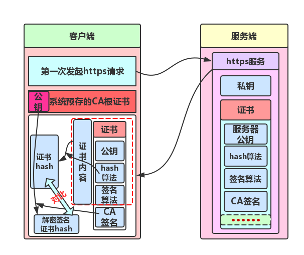
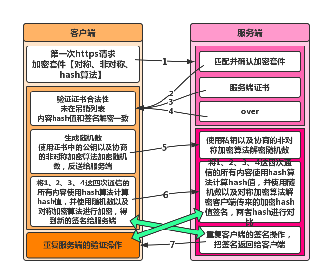

# https的原理
https在http的基础上添加了ssl认证
# 流程（ssl会话）
1. 当浏览器访问某https网址时，浏览器会在请求内容中加入自己支持算法套件(hash算法、对称算法、非对称算法)
2. 服务器比对自己的算法套件之后，找到双方都支持且最优的加密算法，然后告知给浏览器，连同自己的证书发送
3. 浏览器收到同服务器端进行密文通信的算法，并验证数字证书

+ 通过认证机构的公钥，按照证书的签名算法进行解密，得到hash值
+ 使用证书中的hash算法对证书信息hash值进行计算
+ 对比两段hash值
4. 客户端信任了服务端的证书，并和服务端确认了双方的加密算法【握手中需要的非对称算法、握手信息验证的hash算法、正文传输的对称加密】；
5. 客户端生成随机数，通过证书中的公钥按照约定的非对称加密算法进行加密，得到加密的随机数秘钥，同时将之前所有的通信信息【秘钥算法套件、证书等所有的通信内容】按照约定的hash/摘要算法获取hash值，并使用随机数和协商好的对称加密算法进行签名加密，将随机数秘钥和加密签名发送到服务端。
6. 服务端收到随机数秘钥和加密签名，先使用私钥将随机数按照约定的非对称解密算法进行解密，获取随机数，同时使用随机数按照约定的对称解密算法进行解密，获取待验证的hash值，将之前的通信消息体【秘钥算法套件、证书等所有的通信内容】按照约定的hash/摘要算法获取hash值，与刚才解密获取的待验证的hash值对比，验证加密成功与否。
7. 成功以后，服务器再次将之前所有的通信信息【秘钥算法套件、证书等所有的通信内容】按照约定的hash/摘要算法获取hash值，并使用随机数和协商好的对称加密算法进行签名加密，将随机数秘钥发送到客户端，
8. 客户端使用随机数按照约定的对称解密算法进行解密，获取待验证的hash值，将之前的通信消息体【秘钥算法套件、证书等所有的通信内容】按照约定的hash/摘要算法获取hash值，与刚才解密获取的待验证的hash值对比，验证加密成功与否，
9. 成功的话整个链接过程完成，之后将使用随机数和约定的对称加密算法进行密文通信，【如果上面的任何步骤出现问题，都将会结束整个握手过程，导致建立安全连接失败】。

参考链接：https://segmentfault.com/a/1190000014835279

# HTTP和HTTPS的区别
- 1、HTTPS是加密传输协议，HTTP是明文传输协议;
- 2、HTTPS需要用到SSL证书，而HTTP不用;
- 3、HTTPS比HTTP更加安全，对搜索引擎更友好，利于SEO,
- 4、HTTPS标准端口443，HTTP标准端口80;
- 5、HTTPS基于传输层，HTTP基于应用层;