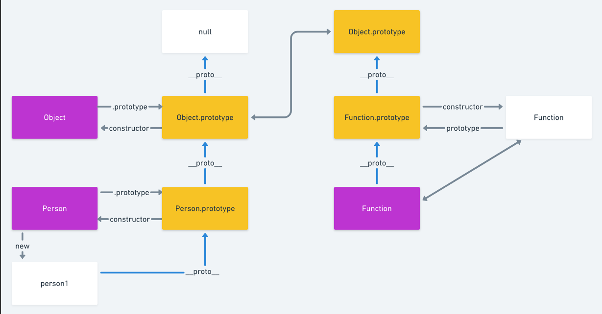

# 关于原型必须要知道的那些事
+ 实例成员和静态成员
凡是通过this来创建的成员就是实例成员，只能通过实例化对象才能进行调用；
补充点：每个实例化对象都会开辟出新的空间，详见构造函数篇；
而静态成员是构造函数本身的对象，只能通过构造函数才能访问到；
+ 由于每产生一个实例都要开辟一处内存空间，而相同的函数、变量会造成内存的浪费，所以我们使用原型来存放共有属性与方法

## 函数的原型链与继承
### 普通对象与函数对象
在JS中万物皆是对象，当然对象也分为**普通对象和函数对象**
**Object和Function是JS自带的函数对象**
当我们new一个function的时候，我们可以发现，它自带了一个prototype属性；
而当我们new一个object的时候，他的原型实例是通过__proto__来进行访问的；
**由此我们可以知道只有函数对象(普通函数对象和构造函数对象)，才能通过prototype属性访问到其原型实例**
**而其他的产生对象都是一个普通对象，我们只能通过__proto__访问其原型实例**
```js
    // Person是一个构造函数对象
    function Person(name,height){
            this.name = name;
            this.height = height;
        }
    // person是一个普通函数对象
    var person = new Person('jsck',180);
    console.log(Person.prototype);
    console.log(person.__proto__);
    // 以下全为true
    console.log(Person.prototype);
    console.log(person.__proto__);
    console.log(Person.prototype==person.__proto__);
    console.log(Person.prototype.constructor===Person);
    console.log(person.__proto__.constructor===Person);
    console.log(Person.prototype.__proto__===Object.prototype);
    console.log(Object.__proto__===null);
     // 比较特殊
    console.log(Function.prototype);     
        
```
在我们研究原型链的时候，往往会产生一个误区，原型链是通过prototype来向上寻找的，但是实际是哪个从实例中分析我们可以看出原型链其实是通过__proto__属性连接的；

# 原型链的继承问题
1. 继承方式一
通过call的方式继承
```js
function Father(name){
    this.name = name;
}
Father.prototype.say = function(){
    console.log('hello '+this.name);
    
}

function Son(name,age){
    // 通过call方法继承了父类
    Father.call(this,name);
    this.age = age;
}

let son = new Son('jack',18);
let father = new Father('rose');
father.say();
// 报错
// son.say();
```
使用call方法继承时，只能继承部分属性，但是父对象的方法不能继承
2. 方法二
在原来基础上，让子类继承父类的实例

**流程图**
